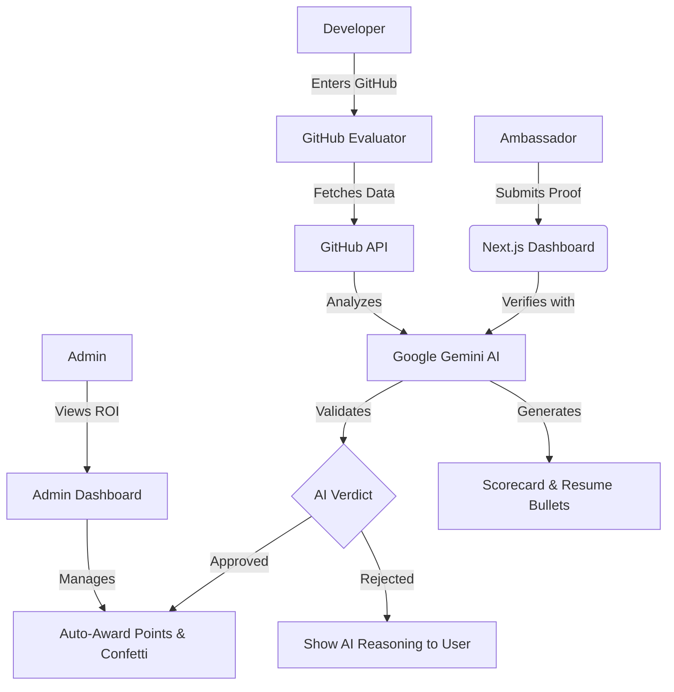

# CampusConnect AI: Automated Ambassador Management Platform

> **Revolutionizing Campus Ambassador Programs with Automated AI Verification & GitHub Insights.**

CampusConnect AI is an end-to-end management platform designed to replace fragmented spreadsheets and WhatsApp groups with a centralized, gamified system. It features an innovative **GitHub Profile Evaluator** that provides recruiter-level insights for student developers in seconds.

## 📺 Video Demo
> **Watch the full platform walkthrough here:** [Link to Demo Video (Coming Soon)]

---

---

## 🚀 Key Features

### 1. Automated Ambassador Workflows
- **AI Task Verification:** Real-time verification of proof-of-work (LinkedIn posts, event photos, repository links) using **Google Gemini AI**.
- **Self-Service Submissions:** Ambassadors submit tasks directly through a premium glassmorphism dashboard.
- **Auto-Approval Logic:** Valid submissions are instantly approved by AI, awarding points and streaks without manual intervention.

### 2. GitHub Profile Evaluator (Recruiter Lens)
- **Real-Time Assessment:** Fetches and analyzes repositories to provide a "Recruiter Score".
- **AI Resume Builder:** Instantly generates professional, action-oriented resume bullet points from project code.
- **Shareable Scorecards:** High-quality image generation for sharing achievements on LinkedIn/Twitter.
- **AI Mentor Chat:** A repository-aware chatbot that gives personalized advice on how to improve specific projects.

### 3. Gamification Engine
- **Live Leaderboards:** Real-time rankings of top ambassadors.
- **Badge System:** Unlock Diamond, Gold, and Silver status based on performance.
- **Streak Tracking:** Motivation through daily activity tracking.

### 4. Smart Admin Dashboard (ROI Portal)
- **Program Analytics:** Track Total Ambassadors, Tasks Completed, and Estimated Reach (ROI).
- **Task Creator:** Admins can instantly deploy new tasks to all ambassador dashboards.
- **Manual Override:** Review and approve/reject submissions that need a human touch.

---

## 🛠️ Tech Stack

- **Frontend:** Next.js (TypeScript), React, CSS Glassmorphism
- **AI Engine:** Google Gemini 2.5 Flash
- **Data Persistence:** LocalStorage (Demo Mode) / Integration-Ready
- **Image Generation:** html2canvas
- **Animations:** Custom CSS Keyframes & canvas-confetti

---

## 📐 Architecture



---

## 🏁 Getting Started

### Prerequisites
- Node.js 18+
- Gemini API Key

### Installation

1. Clone the repository:
   ```bash
   git clone https://github.com/Anoop-singh225/campusconnect.git
   ```

2. Install dependencies:
   ```bash
   npm install
   ```

3. Set up environment variables:
   Create a `.env.local` file:
   ```env
   GEMINI_API_KEY=your_key_here
   ```

4. Run the development server:
   ```bash
   npm run dev
   ```

---

## 🏆 Hackathon Goals Met
- **User Experience (25%):** Premium Deep Obsidian & Electric Violet theme with Aurora animations.
- **Innovation (20%):** AI-powered proof verification and repository-aware mentoring.
- **Impact (20%):** Solving the real-world problem of ambassador retention and recruiter readiness.
- **Functionality (20%):** Full end-to-end flow from evaluation to dashboard to admin.

---

Built with ❤️ for the Hackathon by **Anoop Singh**.
